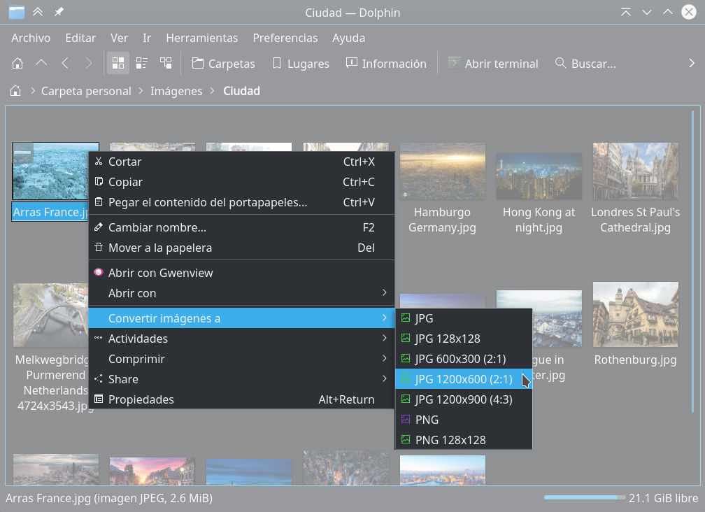

Title: Crear menús de servicios en Dolphin
Slug: dolphin-menu-servicios
Summary: Cómo crear menús de servicios o acciones en Dolphin que se van a desplegar en el menú contexual.
Tags: kde
Date: 2018-09-20 08:02
Modified: 2018-09-20 08:02
Category: apuntes
Preview: preview.jpg

Las acciones de Dolphin, también llamadas "menús de servicios", sirven para ejecutar un programa enviando como parámetros los archivos seleccionados.

Como ejemplo, es un trabajo frecuente preparar las imágenes para un sitio web; porque consume varios minutos abrir cada imagen, recortar, cambiar el tamaño y exportar a JPEG o PNG.

Vamos a hacer esa rutina más rápido, simplemente dando clic con el botón derecho sobre las imágenes para convertirlas.

### Instale ImageMagick

Para hacer la conversión de las imágenes usaremos **ImageMagick**. En **Fedora Linux** se instala como `root` con...

    # dnf install ImageMagick

### Elabore los Bash Scripts

Como se trata de programas propios, no del sistema, conviene tenerlos en un `bin` personal...

    $ mkdir ~/bin

Cree un script para convertir las imágenes a PNG...

    $ kwrite ~/bin/imagen-png.sh

Con este contenido...

    #!/bin/bash

    for ARCHIVO in "$@"
    do
        DIR=`dirname "$ARCHIVO"`
        NOMBRE=`basename "${ARCHIVO%.[^.]*}"`
        SALIDA="${DIR}/${NOMBRE}.png"
        convert "$ARCHIVO" "$SALIDA"
    done

Cree un script para convertir las imágenes a JPEG...

    $ kwrite ~/bin/imagen-jpg.sh

Con este contenido...

    #!/bin/bash

    for ARCHIVO in "$@"
    do
        DIR=`dirname "$ARCHIVO"`
        NOMBRE=`basename "${ARCHIVO%.[^.]*}"`
        SALIDA="${DIR}/${NOMBRE}.jpg"
        convert -quality 80 "$ARCHIVO" "$SALIDA"
    done

Hágalos ejecutables...

    $ chmod +x ~/bin/imagen-png.sh
    $ chmod +x ~/bin/imagen-jpg.sh

Pruebe desde una terminal que funcionen. Son capaces de recibir muchos archivos para convertir. Por ejemplo...

    $ cd ~/Descargas
    $ ~/bin/imagen-jpg.sh logotipo.png
    $ ~/bin/imagen-jpg.sh pagina-1.png pagina-2.png pagina-3.png
    $ ~/bin/imagen-png.sh *.jpg

### Crear acciones para Dolphin en KDE 5

Averigüe dónde deben de estar los archivos de las acciones; para ello, en **KDE 5,** ejecute...

    $ kf5-config --path services
    /home/USUARIO/.local/share/kservices5/:/usr/share/kservices5/

Por defecto no existe el directorio, hay que crearlo...

    $ mkdir -p ~/.local/share/kservices5

Nos cambiamos a ese directorio...

    $ cd ~/.local/share/kservices5

Cree un archivo `desktop`. En este ejemplo, vamos a definir acciones para convertir archivos...

    $ kwrite ConvertImages.desktop

Con este contenido...

    [Desktop Entry]
    Type=Service
    ServiceTypes=KonqPopupMenu/Plugin
    X-KDE-ServiceTypes=KonqPopupMenu/Plugin
    MimeType=image/*;
    Actions=ConvertToPNG;ConvertToJPG;
    X-KDE-Submenu=Convert images to
    X-KDE-Submenu[es]=Convertir imágenes a
    Encoding=UTF-8

    [Desktop Action ConvertToPNG]
    Name=Convert to PNG
    Icon=image-png
    Exec=~/bin/imagen-png.sh %F

    [Desktop Action ConvertToJPG]
    Name=Convert to JPG
    Icon=image-jpeg
    Exec=~/bin/imagen-jpg.sh %F

Reinicie Dolphin y pruebe.

Algunas de las opciones que tiene ese archivo son:

* Un `Desktop Entry` y uno o varios `Desktop Action`.
* En `Actions` se declaran cada acción, que deben aparacer más adelante como `Desktop Action`.
* En `MimeType` se filtra que la acción es para cualquier archivo de imagen.
* Con `X-KDE-Submenu` se define el nombre a usar en el menú contextual.
* Las acciones, que forman el sub-menú, tienen en `Name` su nombre, en `Icon` el icono a mostrar y la orden a ejecutar en `Exec`.
* En `Exec` está el programa y sus parámetros. En este caso `%F` es para pasar muchos archivos con sus rutas completas.

Lea la documentación de [ImageMagick](https://imagemagick.org/) para crear sus propios scripts. Por ejemplo, elaborar imágenes previas (128x128) o fondos de escritorio (1920x1080).

### Referencias

* [ArchLinux - Forum - Custom File Actions in Dolphin](https://bbs.archlinux.org/viewtopic.php?id=136722)
* [FreeDesktop - Desktop Entry Specification](https://specifications.freedesktop.org/desktop-entry-spec/latest/index.html)
* [ImageMagick](https://imagemagick.org/)
* [KDE Forum - How do I add a custom right-click menu command in dolphin?](https://forum.kde.org/viewtopic.php?t=10667)
* [KDE Store - KDE-DolphinServiceMenu-Share como ejemplo](https://store.kde.org/p/1228224/)

