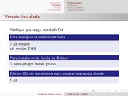
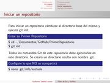
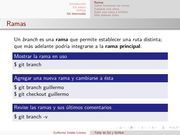

Title: Taller de Git y GitHub
Slug: git-y-github-taller
Summary: Presentación para el Taller de Git y GitHub.
Tags: git
Date: 2015-09-27 23:40
Modified: 2015-09-27 23:40
Category: presentaciones
Preview: git.png

En el [Congreso de Software Libre GULAG 2015](http://www.gulag.org.mx/entradas/2015-09-02-congreso-2015.html) impartí el **Taller de Git y GitHub** durante el cual se mostraron y practicaron comandos de **git** así como las ventajas ofrecidas por [GitHub](https://github.com/).

### Descargar

* [Presentación PDF 232 KB](git-y-github-taller.pdf)
* [Fuentes LaTeX 3.3 KB](git-y-github-taller.tar.gz)
